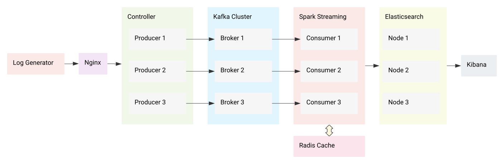
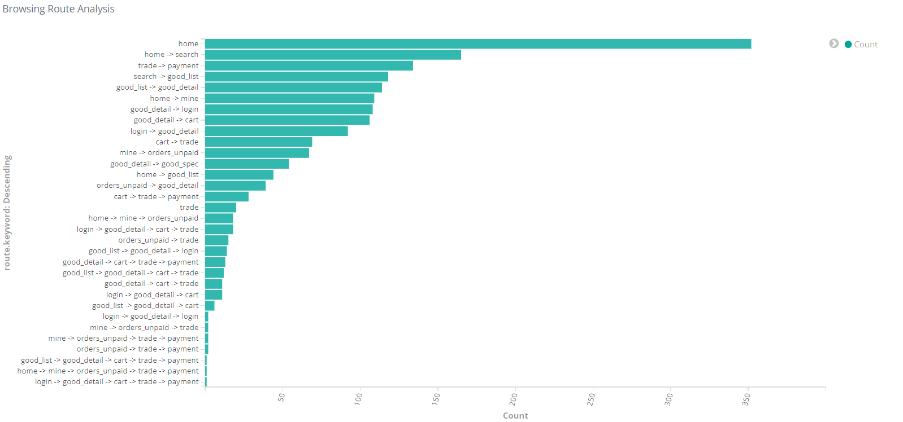
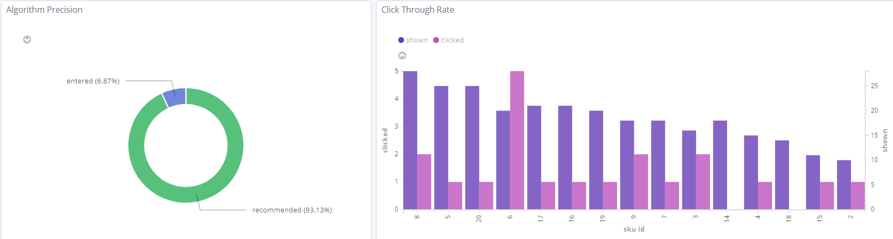
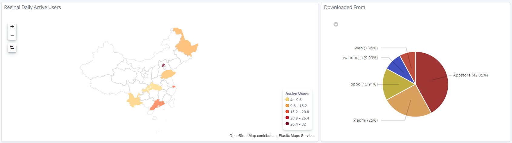

# E-Commerce Index Analysis

# Architecture



# Log

👉 The log is generated by a simulator

```json
{
  "common": {
    "ar": "110000",
    "ba": "iPhone",
    "ch": "Appstore",
    "md": "iPhone X ",
    "mid": "mid_41",
    "os": "iOS 13.2.3",
    "uid": "369",
    "vc": "v2.1.111"
  },
  "displays": [
    {
      "display_type": "query",
      "item": "6",
      "item_type": "sku_id",
      "order": 10
    }
  ],
  "page": {
    "during_time": 14807,
    "item": "2",
    "item_type": "sku_id",
    "last_page_id": "orders_unpaid",
    "page_id": "good_detail",
    "source_type": "query"
  },
  "ts": 1677828069291
}
```

👉 Only fields that are useful for our indices are considered. Other fields may be ignored.

## Timestamp (`ts`) Field

This field records the timestamp when certain a certain take place

## `Common` Field

This is used to analyse daily active users.

Only `start` event (Launching the app) contains this field

The `ts` field is used and the date is extracted to filter multiple launching event within a day

|       | Attribute       | Comment                                                        |
|-------|-----------------|----------------------------------------------------------------|
| `ar`  | area code       | the postal code of mainland China, specified in enums/MyRegion |
| `mid` | device id       | device identifier                                              |
| `uid` | user id         |                                                                |
| `ch`  | install channel | source of download                                             |
| `vc`  | version control | app version                                                    |

## `Display` Field

This field exists when items are displayed to the user through promotions, ads and recommendation

(The field `display_type` does not contains `query`)

|                | Attribute                | Comment                                                                                                                          |
|----------------|--------------------------|----------------------------------------------------------------------------------------------------------------------------------|
| `display_type` | type of this display     | `recommend`: system recommendation </br> `promotion`: promotion content </br> `activity`: sale </br> `query`: user search result |
| `item_type`    | type of the `item` field | `sku_id` for a single item, `sku_ids` for multiple items separated by `,`                                                        |
| `item`         | item id(s)               | single item id like `1`, or multiple item ids like `2,3,4`                                                                       |
| `order`        | id of the order          |                                                                                                                                  |

## `Page` Field

This field has some similar fields as the `display` field

(The field `source_type` contains `query`)

|              | Attribute        | Comment                                                                                  |
|--------------|------------------|------------------------------------------------------------------------------------------|
| during_time  | duration         | The time during which the user stays and browses the page                                |
| page_id      | type of page     | specified in enums/PageType. Examples are home page, search page, payment page and so on |
| last_page_id | previous page id | previous page of a browsing route                                                        |

# Indices
## Browsing Route Analysis

[demo video](https://youtu.be/K5r3sa3haQY)

We analyse the browsing route to discover user’s behaviour pattern and see the overall conversion rate of the platform



fields needed:

| Field          | Usage                           |
|----------------|---------------------------------|
| `uid`          | user id to identify route cache |
| `page_id`      | current page                    |
| `last_page_id` | previous page                   |
| `ts`           | timestamp                       |

We first query the last route history of a user from the Radius cache and get the most recent page of that route.

Then we compare the most recent page from that route with the `last_page_id` in the current log to see if the route is
continuous.

If the route is continuous, we append the `page_id` to the route and update the cache.

If the route is not continuous, we submit this route history and start a new route with `page_id`.

## Click Through Rate & Recommendation Algorithm Precision

[demo video](https://youtu.be/8VN9t5RlX5s)

CRT and algorithm precision tells the successfulness the promotion and recommendation algorithm are.

⚠️ Note that the unit of `clicked` and `shwon` data is different, specifically in this case, 1:5.



fields needed:

| Field                  | Meaning                                                                           | Comment                                                                                                                          |
|------------------------|-----------------------------------------------------------------------------------|----------------------------------------------------------------------------------------------------------------------------------|
| `common.ar`            | area code to analyse a specific region                                            |                                                                                                                                  |
| `display.display_type` | the type of promotion/impressions                                                 | `recommend`: system recommendation </br> `promotion`: promotion content </br> `activity`: sale </br> `query`: user search result |
| `page.source_type`     | the type of promotion/impression from which the user enters into the product page | `recommend`: system recommendation </br> `promotion`: promotion content </br> `activity`: sale </br> `query`: user search result |
| `ts`                   | timestamp                                                                         |                                                                                                                                  |

## Daily Active User & Download Channel Distribution

[demo video](https://youtu.be/jpxFr2ZYsVw)

DAU shows which regions has the highest online users (app launch). The download channel distribution shows the
effectiveness of app promotion from different app stores.



fields needed:

| Field        | Usage            |
|--------------|------------------|
| `common.mid` | device id        |
| `common.uid` | user id          |
| `common.ar`  | area code        |
| `common.ch`  | download channel |
| `common.vc`  | app version      |
| `ts`         | timestamp        |